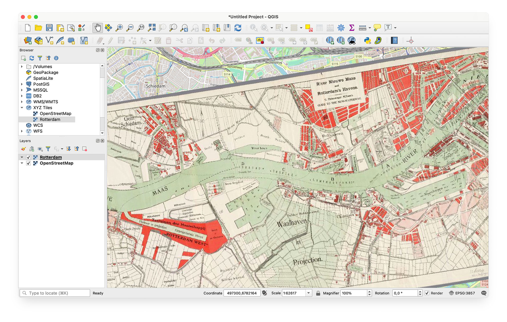

# Allmaps Tile Server

This repository is archived. Please see https://github.com/allmaps/allmaps.

Turns maps georeferenced with Allmaps into XYZ map tiles.

See https://observablehq.com/@bertspaan/allmaps-tile-server.

## Run locally

First, start Redis:

    docker run -p 6379:6379 -d redis

Then:

    npm run dev
